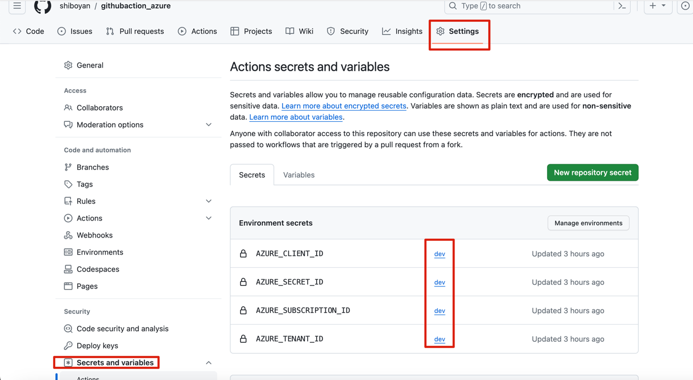
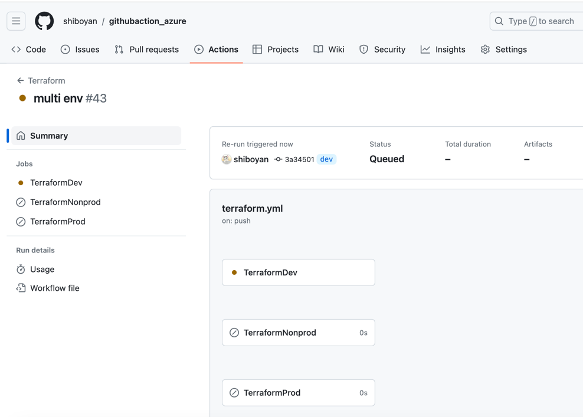
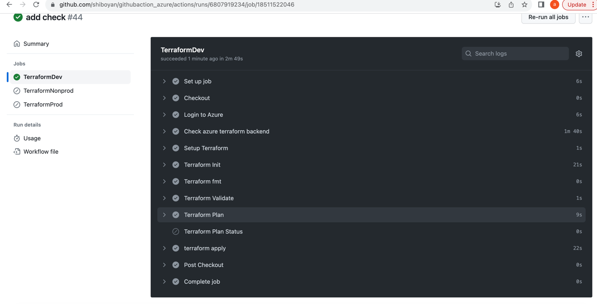

# Azure_terraform

## Introduction 
This repo is use github action build the cicd pipeline for create a nsg in azure for multi env

The Repo use github action to run CI/CD pipeline build terraform infra When create a Pull request ,automatically run the cicd pipeline to Multiple env.
This github repo should have the following branches

Includes: dev, release

The dev branch is deployed to the dev environment, and the release branch is deployed to nonprod.
Create tags when deploying to production
## Prerequisites
Running in azure requires an azure account 😀
#### Create an azure service principal Bash script
```
az ad sp create-for-rbac --name myServicePrincipalName1 --role reader --scopes /subscriptions/00000000-0000-0000-0000-000000000000/resourceGroups/myRG1
```
#### Configure the cred in the github setting

 Also put the terraform backend location in the setting,include backend tf storage account location , rg location etc, by doing this can better record terraform state

## Getting Started
After finished the cred setting then we can get start 
This pipeline include 3 env ,and when push the code to different branch it will trigger to deploy to different env.
For every env it created specific workspace ,so the multi env won't impact with each other as below

And for every env, then CICD pipeline include steps such as "login azure","checkout azure backend",terraform init workspace","terraform fmt check","terraform plan","terraform apply" etc as below

